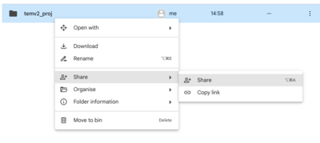
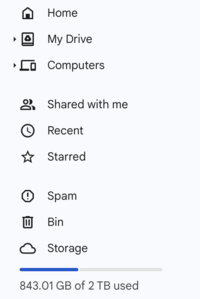

We can use Rclone to sync the Wwise `Originals` folder with teammates, enabling us to use Git for versioning without running into GitHub's file size limit issues, whether for a single asset or the global repository limit when using Git LFS (Large File Storage).

> [!info]
> Another possible solution is to keep the `Originals` folder in a separate location and let the Google Drive desktop application handle syncing. However, I find this approach prone to errors and problems due to the way the Google Drive app operates.

It is possible to use other services, but keep in mind that not all services correctly handle shared folders with Rclone (e.g., Mega).

For the **first step**, the team member managing the repository will create a folder on their Google Drive account named `wwise_projects`. 
This folder will store all the files for all projects the person will be using in the future. 
Next, create another folder inside the main one with your project name, for example, `temv2_proj`.

Upload the `Originals` folder of your Wwise project (this folder should contain at least two subfolders named `SFX` and `Voices`) using the upload button on the Drive web interface. 

Once you’ve finished uploading the folder to Drive, press the share button on the `temv2_proj` folder (right-click or use the share option from the web interface).




At this point share the folder with the other team mates giving them full editing permissions.

Now the **other team member** can also setup their Google Drive.
They can also create the folder mentioned before to store their wwise projects: `wwise_projects`

Next they should find the **Shared with Me** section on the left menu



In that section you will find the folder shared with you, right click and go to `Organize>Create Shortcut` , create a shortcut inside the `wwise_projects` folder.

At this point go to your `My Drive` navigate to the `wwise_projects` and verify the presence of the shortcut inside the folder.

Great now let's use **rclone**.

Install rclone following the instructions showed in this page: [https://rclone.org/install/](https://rclone.org/install/)
Once **installed** let's setup Google Drive with rclone

run the command `rclone config`

Then start the interactive wizard choosing this options
```
No remotes found, make a new one?
n) New remote
r) Rename remote
c) Copy remote
s) Set configuration password
q) Quit config
n/r/c/s/q> n
```

```
name> wwise_proj
```

```
Type of storage to configure.
Choose a number from below, or type in your own value
[snip]
XX / Google Drive
   \ "drive"
[snip]
Storage> drive
```

```
Google Application Client Id - leave blank normally.
client_id>
Google Application Client Secret - leave blank normally.
client_secret>
```

```
Scope that rclone should use when requesting access from drive.
Choose a number from below, or type in your own value
 1 / Full access all files, excluding Application Data Folder.
   \ "drive"
 2 / Read-only access to file metadata and file contents.
   \ "drive.readonly"
   / Access to files created by rclone only.
 3 | These are visible in the drive website.
   | File authorization is revoked when the user deauthorizes the app.
   \ "drive.file"
   / Allows read and write access to the Application Data folder.
 4 | This is not visible in the drive website.
   \ "drive.appfolder"
   / Allows read-only access to file metadata but
 5 | does not allow any access to read or download file content.
   \ "drive.metadata.readonly"
scope> 1
```

```
Service Account Credentials JSON file path - needed only if you want use SA instead of interactive login.
service_account_file>
```

```
Remote config
Use web browser to automatically authenticate rclone with remote?
 * Say Y if the machine running rclone has a web browser you can use
 * Say N if running rclone on a (remote) machine without web browser access
If not sure try Y. If Y failed, try N.
y) Yes
n) No
y/n> y
If your browser doesn't open automatically go to the following link: http://127.0.0.1:53682/auth
Log in and authorize rclone for access
Waiting for code...
Got code
```

```
Configure this as a Shared Drive (Team Drive)?
y) Yes
n) No
y/n> n
Configuration complete.
Options:
type: drive
- client_id:
- client_secret:
- scope: drive
- root_folder_id:
- service_account_file:
- token: {"access_token":"XXX","token_type":"Bearer","refresh_token":"XXX","expiry":"2014-03-16T13:57:58.955387075Z"}
```

```
Keep this "remote" remote?
y) Yes this is OK
e) Edit this remote
d) Delete this remote
y/e/d> y
```

After this setup step rclone is connected with google drive.
let's run `rclone lsd wwise_proj:` to list all directories on gdrive.

Now `wwise_proj rclone config` is linked to your Google Drive main folder, we want to keep the `wwise_proj rclone config` scoped to only the folder we are using for Wwise. 
In order to do this let's add an option to our `rclone config`. 
To check where our `config` is stored you can type this command: `rclong config file` and it will return the path. 
Go to that place and open the file `rclone.conf` with a text editor.

Now your config file should look something like this:
```
[wwise-proj]
type = drive
scope = drive
token = {"access_token":"dnsakdnskabdashbdjsab","token_type":"fdjkda","refresh_token":"ds ajdnsajbndsjabdsjahfkjds","expiry":"2024-11-27T16:06:41.902997+01:00"}
team_drive = 
```
After the token line let's add another setting named `root_folder_id = ` 
This will change the **root folder** from the main drive folder to the one with all your Wwise projects. 
To find the **folder id** go to the Google Drive website, navigate to the folder `wwise_projects` and look at the url. It should look something like this:
drive.google.com/drive/folders/3ulmIpRhLL3gc0n28Za0989wSkzunRWMm?role=writer

This is the part we need:
`drive.google.com/drive/folders/ --> 3ulmIpRhLL3gc0n28Za0989wSkzunRWMm <-- ?role=writer`

Paste it after `root_folder_id` in order to obtain this:
```
[wwise-proj]
type = drive
scope = drive
token = {"access_token":"dnsakdnskabdashbdjsab","token_type":"fdjkda","refresh_token":"ds ajdnsajbndsjabdsjahfkjds","expiry":"2024-11-27T16:06:41.902997+01:00"}
root_folder_id = 3ulmIpRhLL3gc0n28Za0989wSkzunRWMm
team_drive = 
```

If we run `rclone lsd wwise_proj:` now we should only see the folder `temv2_proj`
Now we are ready to copy the content of the drive folder to our wwise project. For the scope of this tutorial let's assume my wwise project is placed at this path on my computer. `~/Desktop/projects/temv2_proj`
We can simply run this command to copy the files: `rclone copy wwise_proj:temv2_proj/Originals ~/Desktop/projects/temv2_proj/Originals`
After running this command all file will be placed in the original folder, now your local project has the same assets as the remote folder.
If you add some files to the wwise project and you want to update the remote folder with your file you can just reverse the command: 
`rclone copy ~/Desktop/projects/temv2_proj/Originals wwise_proj:temv2_proj/Originals`
Now your files have been updated to the remote folder and all the teamates can access them.